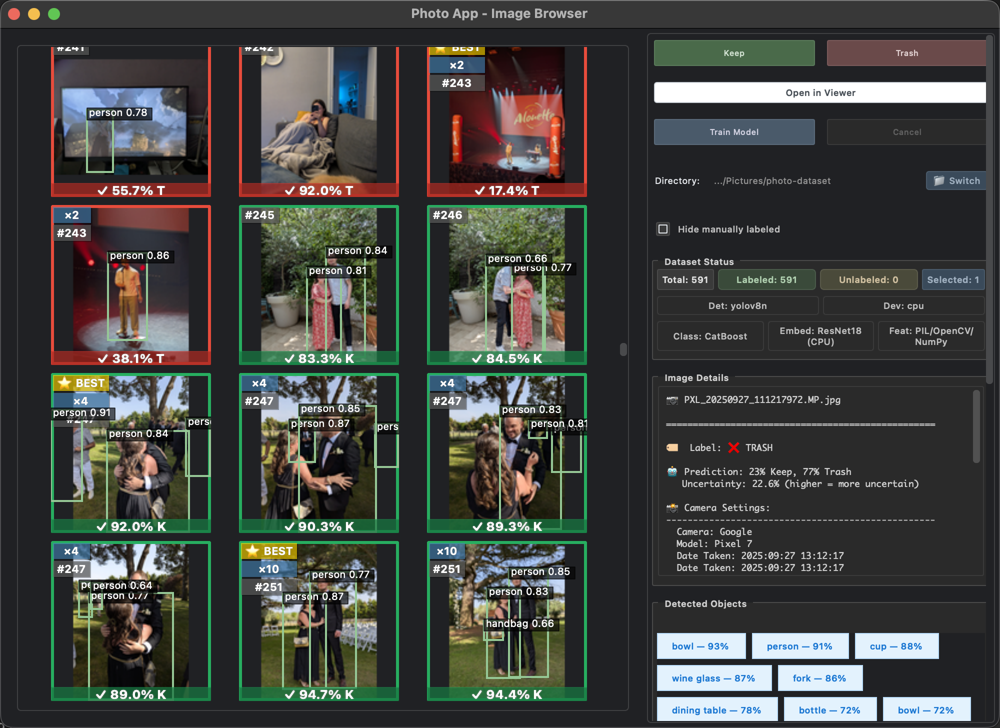

# 📸 Photo Derush

> **Tame your photo chaos with AI-powered triage** 🚀

Photo Derush is a desktop photo management tool that helps you quickly sort through thousands of photos using **machine learning** and **keyboard-first workflows**.




---

## ✨ Features

- **🤖 AI-Powered**: CatBoost model with 75%+ accuracy, optimized to minimize false negatives
- **⚡ Keyboard-First**: Label photos in seconds with keyboard shortcuts
- **🔒 Privacy First**: Everything runs locally—your photos never leave your machine
- **🔄 Real-Time Learning**: Model retrains automatically as you label
- **👁️ Visual Feedback**: See detected objects, EXIF data, and prediction probabilities
- **🌙 Dark Theme**: Easy on the eyes for long labeling sessions
- **📦 Smart Grouping**: Automatically groups similar photos by visual similarity, bursts, and sessions
- **⭐ Best Pick**: Recommends the best photo in each group based on quality metrics
- **🏷️ Group Badges**: Visual indicators show group size, best picks, and group IDs

---

## 🎬 Quick Start

```bash
# Clone and install
git clone https://github.com/TidyMaze/photo-derush.git
cd photo-derush
poetry install

# Run the app
poetry run python app.py
```

**First time?** Select your photo directory, then press `K` to keep or `T` to trash. The AI will start suggesting labels after a few examples.

---

## ⌨️ Keyboard Shortcuts

| Key | Action |
|-----|--------|
| `K` | Mark as **Keep** |
| `T` | Mark as **Trash** |
| `1-5` | Rate image (1=worst, 5=best) |
| `←` `→` | Navigate between images |
| `F` | Fullscreen viewer |
| `?` | Show all shortcuts |

---

## 🧠 How It Works

Uses a **CatBoost classifier** trained on:
- **78 handcrafted features**: EXIF data, quality metrics, histograms
- **128 embedding features**: ResNet18 visual embeddings (PCA-reduced)
- **Object detection**: YOLOv8 for detecting people, objects, and scenes

**Performance**: 75% accuracy, <1% keep-loss rate (rarely misclassifies good photos as trash)

### 📦 Photo Grouping

Photos are automatically organized into groups using:

- **Sessions**: Photos taken within 10 minutes by the same camera
- **Bursts**: Rapid-fire shots within 15 seconds (within a session)
- **Visual Similarity**: Perceptual hashing groups near-duplicates (hash distance ≤ 8)
- **Burst Merging**: Groups from same burst merge if visually similar (distance ≤ 20)

**Best Pick Selection**: Each group gets a recommended "best" photo based on:
- Keep probability score
- Sharpness and exposure quality
- Face detection quality
- Noise and motion blur levels

**Visual Indicators**:
- `⭐ BEST` badge on recommended photos (groups with 2+ images)
- `×N` badge showing group size
- `#ID` badge showing group identifier
- Groups sorted by date, with best picks ranked first within each group

> 📖 **Technical details**: See [docs/CROSS_PLATFORM_COMPATIBILITY.md](docs/CROSS_PLATFORM_COMPATIBILITY.md) and [docs/FILES_CREATED.md](docs/FILES_CREATED.md)

---

## 🛠️ Development

```bash
poetry install
poetry shell
pytest tests/
```

**Tech Stack**: PySide6 (Qt), CatBoost, YOLOv8, ResNet18, SQLite

### Linux Troubleshooting

If you get "no Qt platform plugin could be initialized":

```bash
# Install required system libraries
sudo apt-get install libxcb-xinerama0 libxcb-cursor0 libxcb1 libxkbcommon-x11-0

# Or try setting platform explicitly
QT_QPA_PLATFORM=xcb poetry run python app.py
```

---

## 📚 Documentation

- [Cross-Platform Compatibility](docs/CROSS_PLATFORM_COMPATIBILITY.md)
- [Files Created by App](docs/FILES_CREATED.md)

---

## 🤝 Contributing

Contributions welcome! Report bugs, suggest features, or submit PRs.

---

## 📄 License

MIT License - see LICENSE file for details
