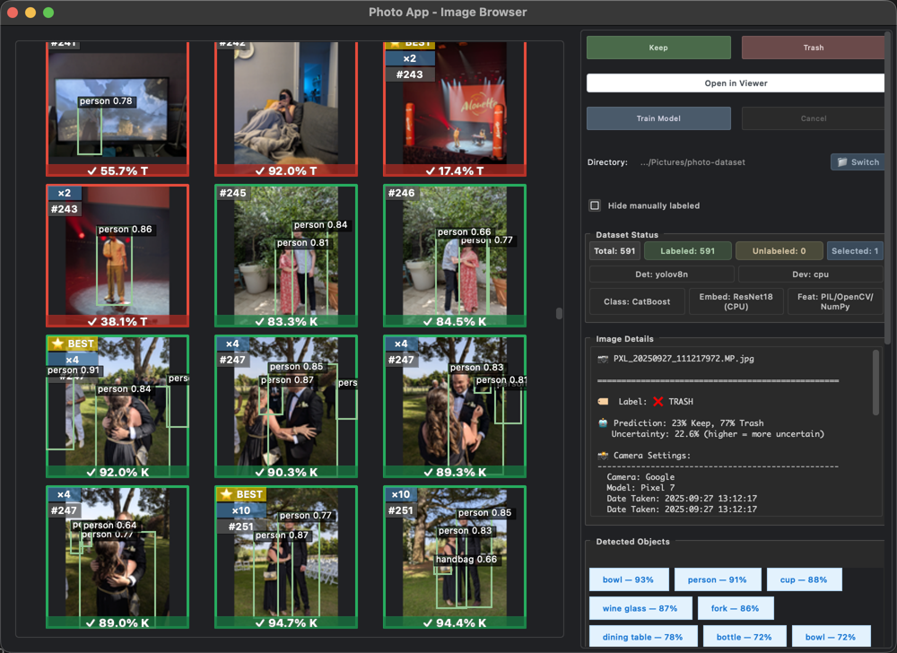

# 📸 Photo Derush

> **Tame your photo chaos with AI-powered triage** 🚀

Photo Derush is a desktop photo management tool that helps you quickly sort through thousands of photos using **machine learning** and **keyboard-first workflows**.




---

## ✨ Features

- **🤖 AI-Powered**: CatBoost model with 75%+ accuracy, optimized to minimize false negatives
- **⚡ Keyboard-First**: Label photos in seconds with keyboard shortcuts
- **🔒 Privacy First**: Everything runs locally—your photos never leave your machine
- **🔄 Real-Time Learning**: Model retrains automatically as you label
- **👁️ Visual Feedback**: See detected objects, EXIF data, and prediction probabilities
- **🌙 Dark Theme**: Easy on the eyes for long labeling sessions
- **📦 Smart Grouping**: Automatically groups similar photos by visual similarity, bursts, and sessions
- **⭐ Best Pick**: Recommends the best photo in each group based on quality metrics
- **🏷️ Group Badges**: Visual indicators show group size, best picks, and group IDs

---

## 🎬 Quick Start

```bash
# Clone and install
git clone https://github.com/TidyMaze/photo-derush.git
cd photo-derush

# Install system dependencies (Linux only, required for Qt)
./scripts/install_system_deps.sh

# Install Python dependencies
poetry install

# Run the app
poetry run python app.py
```

**First time?** Select your photo directory, then press `K` to keep or `T` to trash. The AI will start suggesting labels after a few examples.

---

## ⌨️ Keyboard Shortcuts

| Key | Action |
|-----|--------|
| `K` | Mark as **Keep** |
| `T` | Mark as **Trash** |
| `1-5` | Rate image (1=worst, 5=best) |
| `←` `→` | Navigate between images |
| `F` | Fullscreen viewer |
| `?` | Show all shortcuts |

---

## 🧠 How It Works

Uses a **CatBoost classifier** trained on:
- **78 handcrafted features**: EXIF data, quality metrics, histograms
- **128 embedding features**: ResNet18 visual embeddings (PCA-reduced)
- **Object detection**: YOLOv8 for detecting people, objects, and scenes

**Performance**: 75% accuracy, <1% keep-loss rate (rarely misclassifies good photos as trash)

### 📦 Photo Grouping

Photos are automatically organized into groups using:

- **Sessions**: Photos taken within 10 minutes by the same camera
- **Bursts**: Rapid-fire shots within 15 seconds (within a session)
- **Visual Similarity**: Perceptual hashing groups near-duplicates (hash distance ≤ 8)
- **Burst Merging**: Groups from same burst merge if visually similar (distance ≤ 20)

**Best Pick Selection**: Each group gets a recommended "best" photo based on the model's keep/trash score (highest keep probability wins).

**Visual Indicators**:
- `⭐ BEST` badge on recommended photos (groups with 2+ images)
- `×N` badge showing group size
- `#ID` badge showing group identifier
- Groups sorted by date, with best picks ranked first within each group

> 📖 **Technical details**: See [docs/CROSS_PLATFORM_COMPATIBILITY.md](docs/CROSS_PLATFORM_COMPATIBILITY.md) and [docs/FILES_CREATED.md](docs/FILES_CREATED.md)

---

## 🛠️ Development

```bash
poetry install
poetry shell
pytest tests/
```

**Tech Stack**: PySide6 (Qt), CatBoost, YOLOv8, ResNet18, SQLite

### Linux Troubleshooting

If you get "no Qt platform plugin could be initialized":

**Option 1: Use the automated script (recommended)**
```bash
./scripts/install_system_deps.sh
```

**Option 2: Install manually**
```bash
# Ubuntu/Debian
sudo apt-get install libxcb-xinerama0 libxcb-cursor0 libxcb1 libxkbcommon-x11-0

# Or try setting platform explicitly
QT_QPA_PLATFORM=xcb poetry run python app.py
```

> **Note**: These are system dependencies (not Python packages) and cannot be managed by Poetry. See `pyproject.toml` for details on other distributions.

---

## 📚 Documentation

- [Cross-Platform Compatibility](docs/CROSS_PLATFORM_COMPATIBILITY.md)
- [Files Created by App](docs/FILES_CREATED.md)

---

## 🤝 Contributing

Contributions welcome! Report bugs, suggest features, or submit PRs.

---

## 📄 License

MIT License - see LICENSE file for details

---

## 📋 Backlog (TODO List)

Below is the list of issues encountered while running the project and its tests:

- [x] **CatBoost holdout early stopping error on small datasets**
  - **Symptom**: `_catboost.CatBoostError: To employ param {'use_best_model': True} provide non-empty 'eval_set'.`
  - **Details**: Bypassing early stopping on small datasets (< 20 samples) leaves `use_best_model` set to `True` on the CatBoost model, which crashes when fitting without an evaluation set.

- [x] **Missing `.webp` support**
  - **Symptom**: Scanning `photos-mariage` only loads 26 photos (instead of 320) because the default `allowed_exts` in `ImageModel` does not include `.webp` files.

- [x] **`test_update_label_icon` test failures**
  - **Symptom**: `test_update_label_icon_missing_pixmap_raises` (fails to raise `ValueError`) and `test_update_label_icon_missing_offset_raises` (`TypeError: QPainter.__init__ called with wrong argument types: PixmapLike`).
  - **Details**: `update_label_icon` logs a warning and returns instead of raising, and the mock `PixmapLike` class is not a valid `QPaintDevice` for `QPainter`.

- [x] **`test_viewmodel_fails_fast_on_malformed_batch` test failure**
  - **Symptom**: `Failed: DID NOT RAISE <class 'ValueError'>`
  - **Details**: Mocking `get_objects_for_images` does nothing because it is not used by `_load_object_detections`, and task executes asynchronously in the background.

- [x] **`test_retraining_on_label_changes` test failure**
  - **Symptom**: `set_label called but no image selected`
  - **Details**: The test initializes the viewmodel but never calls `vm.load_images()`. Since the image list is empty, `_apply_filters` triggers `_ensure_selection`, clearing the selected image.

- [x] **Background retraining progress reporter crash**
  - **Symptom**: `AttributeError: 'NoneType' object has no attribute 'update'` / `detail` in `auto_label_manager.py` (lines 835, 980) when running retraining in a background thread with progress reporter set to `None`.

- [x] **Perceptual hashing NoneType error**
  - **Symptom**: `AttributeError: 'NoneType' object has no attribute 'startswith'` in `src/photo_grouping.py:321` when hash computation returns `None`.

- [x] **Test warnings treated as errors**
  - **Symptom**: `DeprecationWarning: 'CatBoostClassifier' object has no attribute '__sklearn_tags__'` fails tests because `pytest.ini` configures `filterwarnings = error`.

